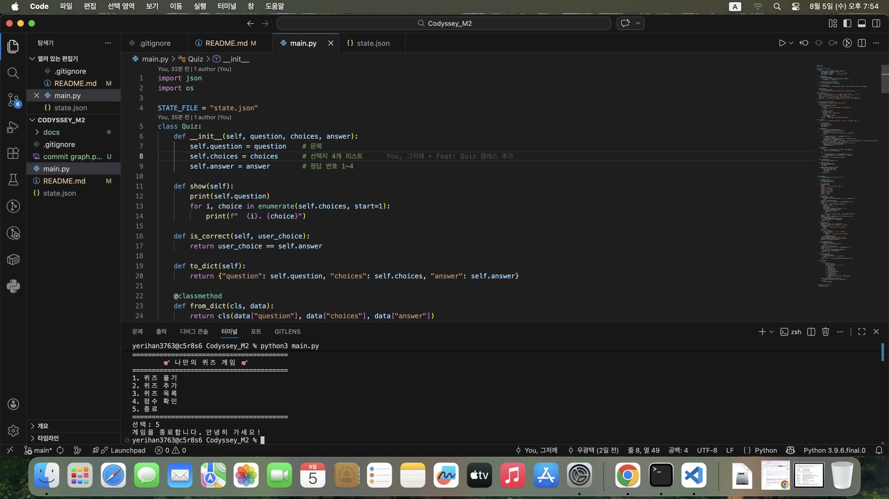
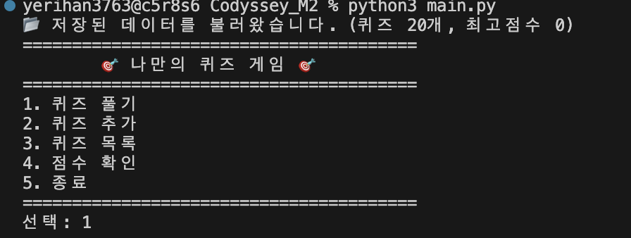
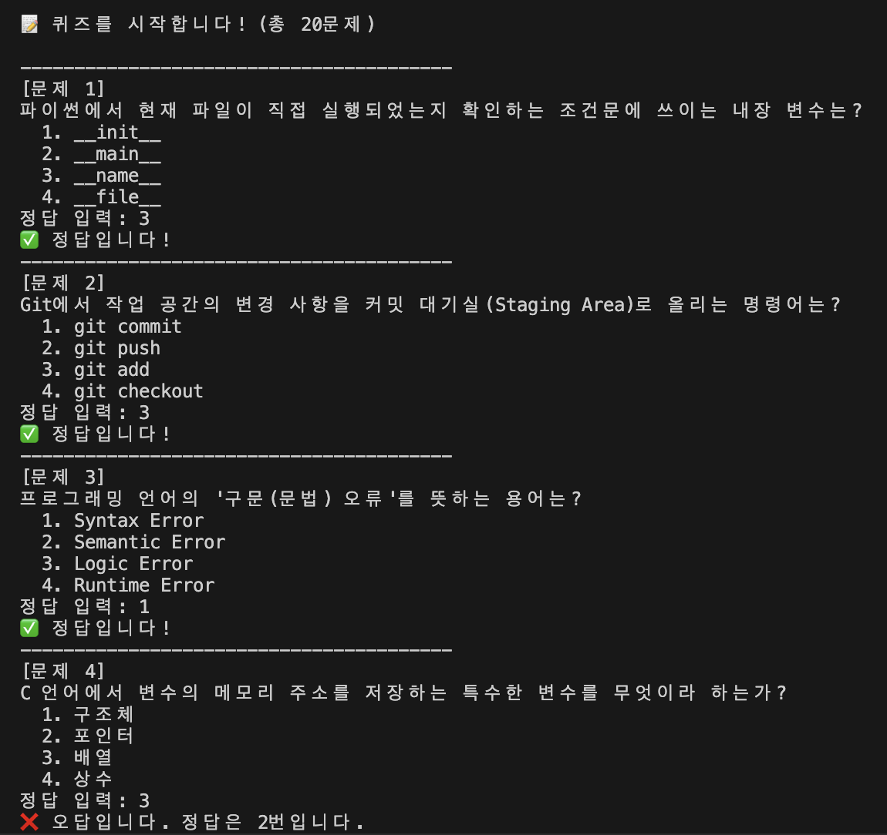
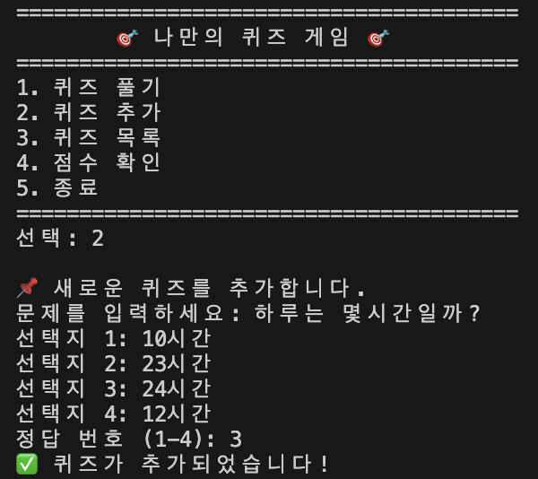
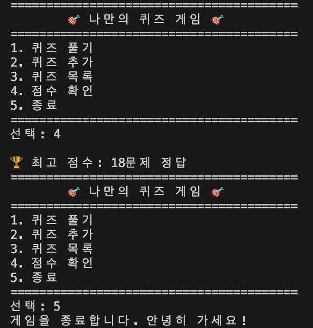
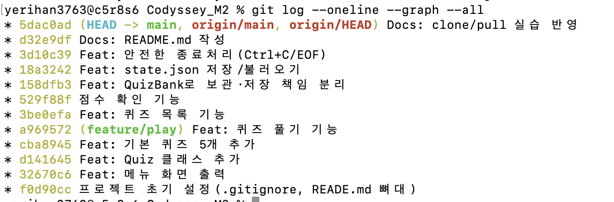

# 🎯 나만의 퀴즈 게임

## 프로젝트 개요
터미널에서 동작하는 콘솔 퀴즈 게임. 퀴즈를 풀고 추가하고 목록·최고점수를 확인하며,
데이터는 파일에 저장되어 재실행해도 유지됩니다.

## 퀴즈 주제와 선정 이유
- 주제: 파이썬, IT
- 선정 이유: 배운 내용 다시 점검

## 실행 방법
​```
python3 main.py
​```
(Python 3.10 이상)

## 기능 목록
- 퀴즈 풀기 / 추가 / 목록 / 점수 확인
- 잘못된 입력·빈 입력·Ctrl+C 안전 처리

## 파일 구조
```text
​my-quiz-game/
├── main.py       # Quiz, QuizBank, QuizGame
├── state.json    # 자동 생성 데이터
├── .gitignore
├── README.md
└── docs/screenshots/
​
```

## 데이터 파일 설명 (state.json)
- 위치: 프로젝트 루트 / 역할: 퀴즈·최고점수를 UTF-8 JSON으로 저장·불러오기
- 없을 때: 기본 퀴즈로 시작, 종료 시 생성 / 손상 시: 안내 후 기본 복구
- 스키마:
​
```css
json
{
  "quizzes": [
    {
      "question": "문제",
      "choices": ["1","2","3","4"],
      "answer": 2
    }
  ],
  "best_score": 3
}
​
```

## 설계 문서
[설계문서](./docs/퀴즈게임_구조A_설계문서.md)

## 프로젝트 진행과정
[진행과정](./docs/퀴즈게임_구조A_프로젝트_여정.md)

## 개발 환경


## 실행 화면





## 다른 폴더에서 git clone
```css
yerihan3763@c5r8s6 M2 % ls -la
total 0
drwxr-xr-x   4 yerihan3763  yerihan3763  128  8  5 19:18 .
drwxr-x---+ 24 yerihan3763  yerihan3763  768  8  5 15:55 ..
drwxr-xr-x   6 yerihan3763  yerihan3763  192  8  4 10:08 Codyssey_M2
drwxr-xr-x   5 yerihan3763  yerihan3763  160  8  3 12:35 Guide

yerihan3763@c5r8s6 M2 % git clone https://github.com/yerihanview/Codyssey_M2.git M2_clone
'M2_clone'에 복제합니다...
remote: Enumerating objects: 34, done.
remote: Counting objects: 100% (34/34), done.
remote: Compressing objects: 100% (18/18), done.
remote: Total 34 (delta 17), reused 31 (delta 14), pack-reused 0 (from 0)
오브젝트를 받는 중: 100% (34/34), 7.82 KiB | 7.82 MiB/s, 완료.
델타를 알아내는 중: 100% (17/17), 완료.
yerihan3763@c5r8s6 M2 % ls -la
total 0
drwxr-xr-x   5 yerihan3763  yerihan3763  160  8  5 19:19 .
drwxr-x---+ 24 yerihan3763  yerihan3763  768  8  5 15:55 ..
drwxr-xr-x   6 yerihan3763  yerihan3763  192  8  4 10:08 Codyssey_M2
drwxr-xr-x   5 yerihan3763  yerihan3763  160  8  3 12:35 Guide
drwxr-xr-x   6 yerihan3763  yerihan3763  192  8  5 19:19 M2_clone
yerihan3763@c5r8s6 M2 % cd M2_clone
yerihan3763@c5r8s6 M2_clone % ls -la
total 32
drwxr-xr-x   6 yerihan3763  yerihan3763   192  8  5 19:19 .
drwxr-xr-x   5 yerihan3763  yerihan3763   160  8  5 19:19 ..
drwxr-xr-x  12 yerihan3763  yerihan3763   384  8  5 19:19 .git
-rw-r--r--   1 yerihan3763  yerihan3763    39  8  5 19:19 .gitignore
-rw-r--r--   1 yerihan3763  yerihan3763  7100  8  5 19:19 main.py
-rw-r--r--   1 yerihan3763  yerihan3763  1305  8  5 19:19 README.md
```
## clone에서 작업 후, git push

```css
yerihan3763@c5r8s6 M2_clone % vi README.md

yerihan3763@c5r8s6 M2_clone % git add README.md
yerihan3763@c5r8s6 M2_clone % git commit -m "Docs: clone/pull 실습 반영"
[main 5dac0ad] Docs: clone/pull 실습 반영
 1 file changed, 34 insertions(+), 1 deletion(-)
yerihan3763@c5r8s6 M2_clone % git push
오브젝트 나열하는 중: 5, 완료.
오브젝트 개수 세는 중: 100% (5/5), 완료.
Delta compression using up to 6 threads
오브젝트 압축하는 중: 100% (3/3), 완료.
오브젝트 쓰는 중: 100% (3/3), 1.58 KiB | 1.58 MiB/s, 완료.
Total 3 (delta 0), reused 0 (delta 0), pack-reused 0 (from 0)
To https://github.com/yerihanview/Codyssey_M2.git
   d32e9df..5dac0ad  main -> main
yerihan3763@c5r8s6 M2_clone % 
```

## 원래 작업 폴더로 돌아가서 git pull

```css
yerihan3763@c5r8s6 M2_clone % 
yerihan3763@c5r8s6 M2_clone % cd ../

yerihan3763@c5r8s6 Codyssey_M2 % git pull
remote: Enumerating objects: 5, done.
remote: Counting objects: 100% (5/5), done.
remote: Compressing objects: 100% (3/3), done.
remote: Total 3 (delta 0), reused 3 (delta 0), pack-reused 0 (from 0)
오브젝트 묶음 푸는 중: 100% (3/3), 1.56 KiB | 798.00 KiB/s, 완료.
https://github.com/yerihanview/Codyssey_M2 URL에서
   d32e9df..5dac0ad  main       -> origin/main
업데이트 중 d32e9df..5dac0ad
Fast-forward
 README.md | 35 ++++++++++++++++++++++++++++++++++-
 1 file changed, 34 insertions(+), 1 deletion(-)

```


## 커밋 그래프

```css
yerihan3763@c5r8s6 Codyssey_M2 % git log --oneline --graph --all
* 5dac0ad (HEAD -> main, origin/main, origin/HEAD) Docs: clone/pull 실습 반영
* d32e9df Docs: README.md 작성
* 3d10c39 Feat: 안전한 종료처리(Ctrl+C/EOF)
* 18a3242 Feat: state.json 저장/불러오기
* 158dfb3 Feat: QuizBank로 보관·저장 책임 분리
* 529f88f 점수 확인 기능
* 3be0efa Feat: 퀴즈 목록 기능
* a969572 (feature/play) Feat: 퀴즈 풀기 기능
* cba8945 Feat: 기본 퀴즈 5개 추가
* d141645 Feat: Quiz 클래스 추가
* 32670c6 Feat: 메뉴 화면 출력
* f0d90cc 프로젝트 초기 설정(.gitignore, READE.md 뼈대)
```

