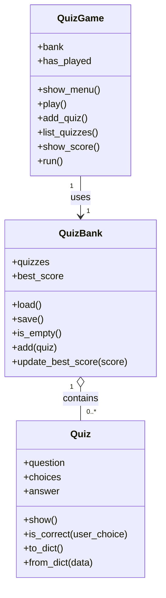

# 🎯 나만의 퀴즈 게임 — 구조 A (책임 분리형) 설계 & 코드

예시(Quiz + QuizGame)를 **3개 클래스**로 다시 나눈 버전입니다. 아래 코드는 제가 실행해 정상 동작을 검증했습니다.

---

## 1. 무엇이 달라졌나 (한눈에)

| | 원래 (예시) | 구조 A (책임 분리형) |
|---|---|---|
| 클래스 | `Quiz`, `QuizGame` | `Quiz`, **`QuizBank`**, `QuizGame` |
| 데이터 보관 | QuizGame이 보유 | **QuizBank가 보유** |
| 저장/불러오기 | QuizGame이 담당 | **QuizBank가 담당** |
| 메뉴·풀기·점수 | QuizGame | QuizGame (그대로) |

> **핵심 아이디어**: 원래 `QuizGame`은 "퀴즈 보관 + 파일 저장 + 메뉴 진행 + 점수"를 혼자 다 했습니다(책임 과다). 이 중 **"데이터를 보관하고 파일에 저장/불러오는 책임"을 `QuizBank`로 떼어냈습니다.** 그러면 `QuizGame`은 "게임을 어떻게 진행하고 보여줄까"에만 집중합니다.

---

## 2. 클래스별 책임

**`Quiz`** — 퀴즈 한 건 (원래와 동일)
- 속성: `question`, `choices`, `answer`
- 메서드: `show()`, `is_correct()`, `to_dict()`, `from_dict()`

**`QuizBank`** — 데이터 보관소 + 영속성 (신규)
| 멤버 | 역할 |
|---|---|
| `quizzes` | 퀴즈 목록 |
| `best_score` | 최고 점수 (저장되는 상태) |
| `load()` / `save()` | state.json 불러오기 / 저장 |
| `is_empty()` | 퀴즈가 비었는지 |
| `add(quiz)` | 퀴즈 추가 + 저장 |
| `update_best_score(score)` | 더 높으면 갱신·저장, 갱신 여부 반환 |

**`QuizGame`** — 진행 + 화면 (역할 축소)
| 멤버 | 역할 |
|---|---|
| `bank` | QuizBank 인스턴스를 가짐(사용) |
| `has_played` | 이번 실행에서 풀었는지 (저장 안 하는 실행용 상태) |
| `show_menu()`, `play()`, `add_quiz()`, `list_quizzes()`, `show_score()`, `run()` | 메뉴·진행·화면 |

---

## 3. 설계 규칙 하나: "state.json의 주인은 QuizBank 하나"

- 파일을 **읽고 쓰는 클래스를 하나로 못 박습니다**(QuizBank). 두 클래스가 같은 파일을 각자 건드리면 충돌하기 쉬우니까요. → 저장 지점이 단일해 안전합니다.
- `best_score`는 **저장되는 상태**라 QuizBank가 보관합니다.
- `has_played`는 **이번 실행 중에만 쓰는 값**(껐다 켜면 초기화돼야 함)이라 QuizGame이 보관합니다.
- 이 "저장되는 상태 vs 실행용 상태" 구분이 이 설계에서 배우는 포인트입니다.

---

## 4. 클래스 관계도



> `o--` 은 "포함"(QuizBank가 Quiz들을 담음), `-->` 는 "사용"(QuizGame이 QuizBank를 씀).

---

## 5. 커밋 순서 변화 (매뉴얼과의 차이)

원래 매뉴얼의 Step 9(=QuizGame으로 리팩터), Step 10(=state.json)이 이렇게 바뀝니다.

| 원래 | 구조 A |
|---|---|
| Step 9: `Refactor: QuizGame 클래스로 정리` | Step 9: `Feat: QuizBank로 보관·저장 책임 분리` |
| Step 10: `Feat: state.json 저장/불러오기` (QuizGame에) | Step 10: `Feat: state.json 저장/불러오기` (QuizBank에) |

나머지 단계·커밋 수·Git 요건은 동일합니다. (여전히 클래스 2개 이상 요건 충족 — 오히려 3개.)

---

## 6. 전체 코드 (검증 완료 · `main.py`)

```python
import json
import os

STATE_FILE = "state.json"


class Quiz:
    """퀴즈 한 건: 문제 + 선택지 + 정답 (데이터)."""

    def __init__(self, question, choices, answer):
        self.question = question
        self.choices = choices
        self.answer = answer

    def show(self):
        print(self.question)
        for i, choice in enumerate(self.choices, start=1):
            print(f"  {i}. {choice}")

    def is_correct(self, user_choice):
        return user_choice == self.answer

    def to_dict(self):
        return {"question": self.question, "choices": self.choices, "answer": self.answer}

    @classmethod
    def from_dict(cls, data):
        return cls(data["question"], data["choices"], data["answer"])


DEFAULT_QUIZZES = [
    Quiz("태양계에서 가장 큰 행성은?", ["수성", "목성", "화성", "지구"], 2),
    Quiz("대한민국의 수도는?", ["부산", "인천", "서울", "대구"], 3),
    Quiz("물의 화학식은?", ["CO₂", "H₂O", "O₂", "NaCl"], 2),
    Quiz("1년은 몇 개월인가?", ["10개월", "11개월", "12개월", "13개월"], 3),
    Quiz("무지개는 보통 몇 색으로 표현하나?", ["5색", "6색", "7색", "8색"], 3),
]


def ask_int(prompt, low, high):
    """low~high 사이의 정수를 안전하게 입력받는다."""
    while True:
        raw = input(prompt).strip()
        if raw == "":
            print("⚠️ 입력이 비어 있습니다. 다시 입력하세요.")
            continue
        try:
            number = int(raw)
        except ValueError:
            print("⚠️ 숫자를 입력하세요.")
            continue
        if low <= number <= high:
            return number
        print(f"⚠️ {low}~{high} 사이의 숫자를 입력하세요.")


class QuizBank:
    """퀴즈 보관 + state.json 저장/불러오기 (데이터·영속성 전담)."""

    def __init__(self):
        self.quizzes = []
        self.best_score = 0
        self.load()

    def load(self):
        if not os.path.exists(STATE_FILE):
            self.quizzes = list(DEFAULT_QUIZZES)
            self.best_score = 0
            print("📂 저장된 데이터가 없어 기본 퀴즈로 시작합니다.")
            return
        try:
            with open(STATE_FILE, "r", encoding="utf-8") as f:
                data = json.load(f)
            self.quizzes = [Quiz.from_dict(d) for d in data["quizzes"]]
            self.best_score = data["best_score"]
            print(f"📂 저장된 데이터를 불러왔습니다. (퀴즈 {len(self.quizzes)}개, 최고점수 {self.best_score})")
        except (json.JSONDecodeError, KeyError, OSError):
            print("⚠️ 데이터 파일이 손상되어 기본 퀴즈로 복구합니다.")
            self.quizzes = list(DEFAULT_QUIZZES)
            self.best_score = 0

    def save(self):
        data = {
            "quizzes": [quiz.to_dict() for quiz in self.quizzes],
            "best_score": self.best_score,
        }
        try:
            with open(STATE_FILE, "w", encoding="utf-8") as f:
                json.dump(data, f, ensure_ascii=False, indent=2)
        except OSError:
            print("⚠️ 저장 중 오류가 발생했습니다.")

    def is_empty(self):
        return len(self.quizzes) == 0

    def add(self, quiz):
        self.quizzes.append(quiz)
        self.save()

    def update_best_score(self, score):
        """더 높으면 갱신·저장하고 True, 아니면 False."""
        if score > self.best_score:
            self.best_score = score
            self.save()
            return True
        return False


class QuizGame:
    """메뉴·풀기·점수 진행 + 화면 흐름 (진행 전담)."""

    def __init__(self):
        self.bank = QuizBank()
        self.has_played = False

    def show_menu(self):
        print("=" * 40)
        print("        🎯 나만의 퀴즈 게임 🎯")
        print("=" * 40)
        print("1. 퀴즈 풀기")
        print("2. 퀴즈 추가")
        print("3. 퀴즈 목록")
        print("4. 점수 확인")
        print("5. 종료")
        print("=" * 40)

    def play(self):
        if self.bank.is_empty():
            print("등록된 퀴즈가 없습니다. 먼저 퀴즈를 추가하세요.")
            return
        quizzes = self.bank.quizzes
        print(f"\n📝 퀴즈를 시작합니다! (총 {len(quizzes)}문제)\n")
        score = 0
        for i, quiz in enumerate(quizzes, start=1):
            print("-" * 40)
            print(f"[문제 {i}]")
            quiz.show()
            user_choice = ask_int("정답 입력: ", 1, 4)
            if quiz.is_correct(user_choice):
                print("✅ 정답입니다!")
                score += 1
            else:
                print(f"❌ 오답입니다. 정답은 {quiz.answer}번입니다.")
        print("=" * 40)
        print(f"🏆 결과: {len(quizzes)}문제 중 {score}문제 정답!")
        self.has_played = True
        if self.bank.update_best_score(score):
            print("🎉 새로운 최고 점수입니다!")
        print("=" * 40)

    def add_quiz(self):
        print("\n📌 새로운 퀴즈를 추가합니다.")
        question = input("문제를 입력하세요: ").strip()
        if question == "":
            print("⚠️ 문제가 비어 있어 취소합니다.")
            return
        choices = []
        for i in range(1, 5):
            choice = input(f"선택지 {i}: ").strip()
            if choice == "":
                print("⚠️ 선택지가 비어 있어 취소합니다.")
                return
            choices.append(choice)
        answer = ask_int("정답 번호 (1-4): ", 1, 4)
        self.bank.add(Quiz(question, choices, answer))
        print("✅ 퀴즈가 추가되었습니다!")

    def list_quizzes(self):
        if self.bank.is_empty():
            print("등록된 퀴즈가 없습니다.")
            return
        quizzes = self.bank.quizzes
        print(f"\n📋 등록된 퀴즈 목록 (총 {len(quizzes)}개)")
        print("-" * 40)
        for i, quiz in enumerate(quizzes, start=1):
            print(f"[{i}] {quiz.question}")
        print("-" * 40)

    def show_score(self):
        if not self.has_played:
            print("아직 퀴즈를 풀지 않았습니다.")
            return
        print(f"\n🏆 최고 점수: {self.bank.best_score}문제 정답")

    def run(self):
        try:
            while True:
                self.show_menu()
                choice = ask_int("선택: ", 1, 5)
                if choice == 1:
                    self.play()
                elif choice == 2:
                    self.add_quiz()
                elif choice == 3:
                    self.list_quizzes()
                elif choice == 4:
                    self.show_score()
                elif choice == 5:
                    print("게임을 종료합니다. 안녕히 가세요!")
                    break
        except (KeyboardInterrupt, EOFError):
            print("\n프로그램을 안전하게 종료합니다.")
        finally:
            self.bank.save()


if __name__ == "__main__":
    QuizGame().run()
```

---

## 7. 원래 버전과 코드가 어떻게 달라졌나 (읽기 포인트)

- `QuizGame.__init__`이 `self.bank = QuizBank()`로 시작 — 이제 데이터는 은행(bank)에 맡깁니다.
- `play`가 `self.quizzes` 대신 **`self.bank.quizzes`**를 씁니다.
- 최고점수 갱신이 `self.bank.update_best_score(score)` **한 줄**로 끝납니다 (비교·저장 로직이 QuizBank 안으로 숨음 = 캡슐화).
- 퀴즈 추가는 `self.bank.add(...)` — 추가와 저장이 은행 책임.
- 파일 저장을 QuizGame이 직접 안 합니다. `run`의 `finally`에서도 `self.bank.save()`로 위임.

> 이렇게 **"QuizGame은 데이터 세부는 모르고, 은행에 시키기만 한다"**가 책임 분리의 감각입니다.

---

*원하시면 이 구조 A에 맞춘 「완결형 매뉴얼」(단계별 따라 하기)도 새로 만들어 드리겠습니다. 지금 문서는 설계+최종 코드까지이고, 매뉴얼은 이걸 커밋 단위로 쪼개 손으로 따라 하는 버전입니다.*
