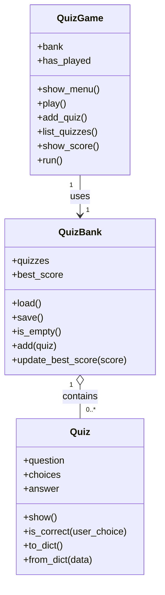
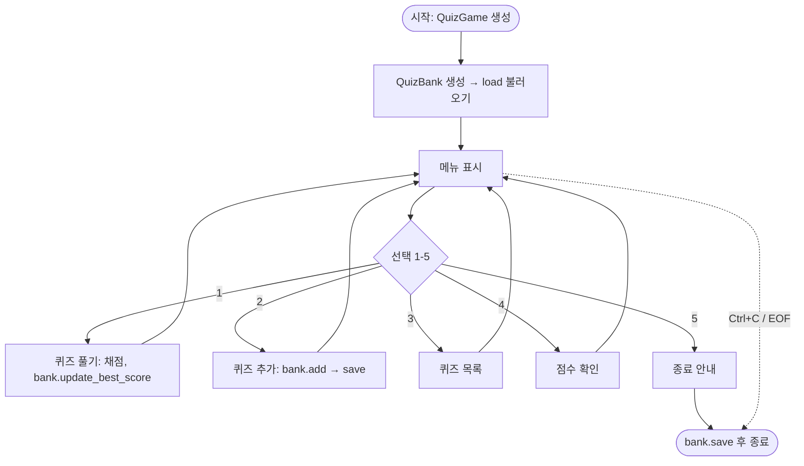
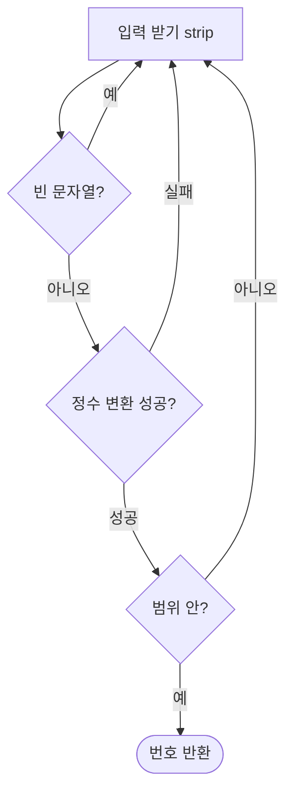

# 🎯 나만의 퀴즈 게임 — 설계 문서 (구조 A)

> 콘솔 퀴즈 게임을 **세 개의 클래스**(`Quiz` · `QuizBank` · `QuizGame`)로 설계한 문서입니다.
> 코드를 짜기 전에 "무엇을·어떻게·왜"를 정하는 산출물입니다.

---

## 1. 개요

| 항목 | 내용 |
|---|---|
| 목적 | 터미널 콘솔 퀴즈 게임을 만들며 Python 기초·OOP·파일 입출력·Git을 체득 |
| 범위 | 단일 사용자, 로컬 실행, 표준 라이브러리만 사용 |
| 실행 환경 | Python 3.10+, macOS(터미널), `python3 main.py` |
| 산출물 | `main.py` + `state.json`(자동 생성) + `README.md` + GitHub 저장소 |
| 설계 원칙 | **책임 분리(SRP)** — 데이터/영속성/진행을 각각 다른 클래스가 맡는다 |

---

## 2. 요구사항 요약

**기능 요구사항 (FR)**

| ID | 기능 | 설명 |
|---|---|---|
| FR-1 | 메뉴 | 1~5 선택, 잘못된 입력(공백/문자/범위 밖/빈 입력) 안전 처리 |
| FR-2 | 퀴즈 풀기 | 순서대로 출제·채점, 결과 표시, 퀴즈 없음 처리 |
| FR-3 | 퀴즈 추가 | 문제+선택지 4개+정답번호 입력받아 등록·저장 |
| FR-4 | 퀴즈 목록 | 등록된 퀴즈 제목 나열 |
| FR-5 | 점수 확인 | 최고 점수 조회, 미플레이 처리 |
| FR-6 | 영속성 | 종료 후 재실행해도 퀴즈·최고점수 유지 |

**비기능/제약 (NFR)**

- 최소 2개 클래스로 역할 분리 (본 설계는 **3개**)
- 데이터는 프로젝트 루트 `state.json`에 **UTF-8**로 저장
- 파일 없음/손상 시에도 실행 가능 (기본 데이터로 복구)
- `Ctrl+C`(KeyboardInterrupt)·입력 종료(EOFError) 시 비정상 종료 금지
- 한 함수에 몰지 않고 기능별로 분리

---

## 3. 아키텍처 개요

세 클래스가 **역할별로 층을 이룹니다.** 각 층은 아래 층에만 의존합니다.

```
┌─────────────────────────────────────────────────┐
│  QuizGame  ── 진행/화면 계층                     │
│  메뉴 루프 · 풀기 진행 · 화면 출력 · 입력 흐름     │
│                    │ uses                       │
│                    ▼                            │
│  QuizBank  ── 데이터/영속성 계층                  │
│  퀴즈 목록·최고점수 보관 · state.json 저장/불러오기 │
│                    │ contains                    │
│                    ▼                            │
│  Quiz      ── 데이터 계층                        │
│  퀴즈 한 건(문제/선택지/정답) · 출력 · 채점        │
└─────────────────────────────────────────────────┘

  ask_int()  ── 공용 입력 유틸 (안전한 숫자 입력, 어디서나 사용)
  DEFAULT_QUIZZES ── 첫 실행용 기본 데이터
                    │  load / save
                    ▼
              ┌──────────────┐
              │  state.json  │
              └──────────────┘
```

**의존 방향**: `QuizGame → QuizBank → Quiz` (한 방향). 상위 계층은 하위를 알지만, 하위는 상위를 모릅니다. → 결합도가 낮아 각 층을 독립적으로 이해·수정할 수 있습니다.

---

## 4. 데이터 모델

**4.1 Quiz (메모리상 객체)**

| 속성 | 타입 | 설명 |
|---|---|---|
| question | str | 문제 지문 |
| choices | list[str] | 선택지 4개 |
| answer | int | 정답 번호 (1~4) |

> 정답을 "번호"로 관리: 사용자 입력도 번호이므로 채점이 단순 비교 한 줄로 끝난다.

**4.2 state.json (저장 형식) — 스키마**

```json
{
  "quizzes": [
    { "question": "문제", "choices": ["1", "2", "3", "4"], "answer": 2 }
  ],
  "best_score": 3
}
```

| 키 | 타입 | 설명 |
|---|---|---|
| quizzes | array | 퀴즈 딕셔너리 목록 |
| best_score | int | 최고 정답 수 |

> **직렬화 경계**: 파일에는 `Quiz` 객체를 못 넣으므로, 저장 시 `to_dict()`로 딕셔너리화, 불러올 때 `from_dict()`로 객체화한다. 이 변환은 `Quiz`가 스스로 담당한다(자기 표현은 자기가 안다).

---

## 5. 클래스 설계

**5.1 `Quiz` — 퀴즈 한 건 (데이터)**

| 메서드 | 역할 |
|---|---|
| `__init__(question, choices, answer)` | 속성 초기화 |
| `show()` | 문제·선택지를 번호와 함께 출력 |
| `is_correct(user_choice)` | 입력 번호가 정답이면 True |
| `to_dict()` | 저장용 딕셔너리로 변환 |
| `from_dict(data)` (classmethod) | 딕셔너리에서 Quiz 생성 |

**5.2 `QuizBank` — 데이터 보관소 + 영속성**

| 속성 | 타입 | 설명 |
|---|---|---|
| quizzes | list[Quiz] | 퀴즈 목록 |
| best_score | int | 최고 점수 (저장되는 상태) |

| 메서드 | 역할 |
|---|---|
| `load()` | state.json 불러오기 (없으면 기본, 손상 시 복구) |
| `save()` | 현재 상태를 state.json에 UTF-8 저장 |
| `is_empty()` | 퀴즈가 비었는지 |
| `add(quiz)` | 퀴즈 추가 후 저장 |
| `update_best_score(score)` | 더 높으면 갱신·저장, 갱신 여부 반환 |

> QuizBank는 **"무엇을 보관하고 어떻게 저장하는가"의 유일한 주인**이다. 데이터에 대한 규칙(추가·최고점수 갱신·저장 시점)이 모두 여기 모인다.

**5.3 `QuizGame` — 진행 + 화면**

| 속성 | 타입 | 설명 |
|---|---|---|
| bank | QuizBank | 데이터 접근 통로 (구성 관계) |
| has_played | bool | 이번 실행에서 풀었는지 (실행용 상태) |

| 메서드 | 역할 |
|---|---|
| `show_menu()` | 메뉴 출력 |
| `play()` | 출제·채점, `bank.update_best_score` 호출 |
| `add_quiz()` | 입력 수집 후 `bank.add` 호출 |
| `list_quizzes()` | 목록 출력 |
| `show_score()` | 최고 점수 출력 |
| `run()` | 메뉴 루프(진입점), 안전 종료 처리 |

> QuizGame은 **데이터 세부 규칙을 모른다.** 필요할 때 `self.bank`에 "추가해줘", "최고점수 갱신해줘"라고 **요청**할 뿐이다.

---

## 6. 상태 소유 규칙 (Persisted vs Runtime)

이 설계의 핵심 결정: **상태를 "저장되는가"로 나눠 소유자를 정한다.**

| 상태 | 소유 클래스 | 이유 |
|---|---|---|
| quizzes | QuizBank | 파일에 저장·복원되는 데이터 |
| best_score | QuizBank | 파일에 저장·복원되는 데이터 |
| has_played | QuizGame | **저장하지 않는 실행용 값** — 껐다 켜면 "아직 안 풂"으로 초기화돼야 함 |

> "이 값이 재실행 후에도 남아야 하나?"라는 질문 하나로 소유자가 갈린다. 남아야 하면 QuizBank(저장 담당), 아니면 QuizGame(진행 담당).

---

## 7. 제어 흐름

**7.1 클래스 관계도**



**7.2 전체 실행 흐름**



**7.3 입력 검증 흐름 (`ask_int`)**



**7.4 저장 시점 (누가 언제 save를 부르나)**

| 계기 | 호출 경로 |
|---|---|
| 퀴즈 추가 | `QuizGame.add_quiz` → `QuizBank.add` → `save` |
| 최고점수 갱신 | `QuizGame.play` → `QuizBank.update_best_score` → `save` |
| 프로그램 종료(정상/강제) | `QuizGame.run`의 `finally` → `QuizBank.save` |

> 저장은 **항상 QuizBank를 거친다.** QuizGame이 파일을 직접 만지지 않는다.

---

## 8. 데이터 영속성 · 예외 처리 정책

| 상황 | 처리 | 담당 |
|---|---|---|
| 파일 없음(첫 실행) | 기본 퀴즈 사용, 종료 시 생성 | QuizBank.load |
| 파일 손상/형식 오류 | 안내 후 기본 퀴즈로 복구 (JSONDecodeError/KeyError) | QuizBank.load |
| 읽기/쓰기 실패 | try/except(OSError)로 안내, 프로그램 유지 | QuizBank.load/save |
| 잘못된 숫자 입력 | 재입력 유도 (공백/문자/범위/빈 입력) | ask_int |
| Ctrl+C / EOF | 안내 후 `finally`에서 저장하고 안전 종료 | QuizGame.run |

---

## 9. 파일 구조

```
my-quiz-game/
├── main.py        # Quiz, QuizBank, QuizGame, ask_int, DEFAULT_QUIZZES
├── state.json     # 실행 시 자동 생성 (gitignore 대상)
├── .gitignore
├── README.md
└── docs/
    ├── design.md          # (이 문서)
    └── screenshots/       # 실행 화면 캡처 (menu/play/add_quiz/score)
```

> `state.json`을 `.gitignore`에 두는 이유: **실행 산출물**이지 소스가 아니며, 새로 clone하면 파일이 없어 "파일 없음 → 기본 데이터" 경로가 자연히 검증된다.

---

## 10. 설계 결정과 이유 (Design Rationale)

| 결정 | 대안 | 채택 이유 |
|---|---|---|
| 클래스 3개(데이터/보관/진행) | 클래스 1~2개에 통합 | 각 클래스가 한 가지 책임만 지게 해 이해·수정·확장이 쉬움(SRP) |
| 파일 입출력을 QuizBank에 집중 | 여러 클래스가 파일 접근 | **저장 지점을 하나로** 못 박아 충돌·중복을 막고, 저장 방식 변경 시 한 곳만 수정 |
| best_score를 QuizBank가 소유 | QuizGame이 소유 | 저장·복원되는 데이터이므로 데이터 계층이 맡는 것이 일관됨 |
| has_played를 QuizGame이 소유 | QuizBank가 소유 | 저장하지 않는 실행용 값이므로 진행 계층에 둠 |
| 정답을 번호(int)로 | 정답 텍스트로 | 입력과 형식이 같아 채점이 단순·정확 |
| 객체↔딕셔너리 변환을 Quiz가 담당 | 외부 함수로 변환 | "자기 표현은 자기가 안다" — 응집도 향상 |
| JSON 저장 | 텍스트/DB | 사람이 읽기 쉽고 표준 라이브러리로 충분, 미션 요건 |

---

## 11. 확장 지점

| 보너스 | 설계상 손댈 곳 | 이유 |
|---|---|---|
| 랜덤 출제 | `QuizGame.play` | 진행 방식 변경 |
| 문제 수 선택 | `QuizGame.play` | 진행 방식 변경 |
| 힌트 | `Quiz`(속성) + `QuizGame.play`(차감) | 데이터+진행 |
| 퀴즈 삭제 | `QuizBank.delete()` | 데이터 관리 책임 |
| 점수 히스토리 | `QuizBank`(저장 데이터에 history 추가) | 저장되는 데이터 |

> 확장 위치가 **"데이터 관련이면 QuizBank, 진행 관련이면 QuizGame"**으로 명확하다. 책임이 나뉘어 있어 새 기능이 어디로 갈지 헷갈리지 않는다 — 이것이 책임 분리의 실질적 이득이다.

---

